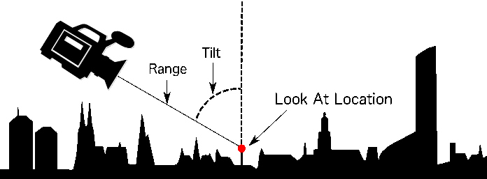

<style>
    iframe {
        width: 100 vw;
        height: 700px;
    }

    #nav-demo {
        background-color: black;
        width: 100%;
        height: 700px;
    }   
</style>
# WebWorldWind Navigation

The WorldWind globe responds to mouse and touch inputs. A Navigator is used to position the eye or view point based on inputs. Some inputs change the position of the globe while others change the positioning of the Navigator. WebWorldWind uses a "look at" setup for defining the eye position. The definition of a "look at" system can be described with the following graphic:



The Navigator state is expressed as:
 - latitude and longitude of a "look at" location
 - range from the "look at" location to the eye
 - tilt angle from a "straight down" view
 - heading based on a typical northern aligned 360 degree compass

### Mouse Inputs

#### Left Click
Left clicking and dragging on the surface of the globe "grabs" the globe and allows you to rotate the globe surface. 

#### Scroll Wheel
The scroll wheel moves the eye point towards and away from the look at position. 

#### Right Click
Right clicking and dragging up or down tilts the the eye while still maintaining the same look at position. Right clicking and dragging left or right rotates the heading of eye.

### Touch Inputs

#### Single Touch
A single touch operates similarly to the left click when using a mouse by dragging the globe.

#### Pinching
A two finger pinch will move the eye point towards and away from the look at position.

#### Two Finger Rotation
Two fingers rotating around each other will rotate the globe.

#### Two Finger Dragging
Dragging two fingers tilts the globe.

Use the globe below to try the different navigation techniques:

<div id="nav-demo-container">
    <canvas id="nav-demo">
        Browser does not support HTML5
    </canvas>
</div>

Conceptually, the view in WebWorldWind can be thought of as a camera positioned at a latitude, longitude, and altitude with a heading, tilt, and rotation.

Controlling navigation can be done with an input device, or programmatically. For smooth, simple view movements to a new geographic position, use the `goTo` function of the `WorldWindow`. Please see the [GoToAnimator](https://nasaworldwind.github.io/WebWorldWind/GoToAnimator.html) documentation for more information.

If you require more explicit control of the navigator, the position, and orientation are provided by the `navigator` property of the `WorldWindow`.

1. Retrieve and display the current navigators latitude, longitude, range, tilt, rotation, and heading:

    ```
    var location = wwd.navigator.lookAtLocation;
    
    var range = wwd.navigator.range;
    
    var tilt = wwd.navigator.tilt;
    
    var roll = wwd.navigator.roll;
    
    var heading = wwd.navigator.heading;
    ```
    
    <script async src="//jsfiddle.net/nasazach/14ufn7hL/12/embed/"></script>

2. Set the position of the navigator to view Mount Yale in Colorado:

    ```
    wwd.navigator.lookAtLocation.latitude = 38.87165744775558;
    ...
    ```
    
    <script async src="//jsfiddle.net/nasazach/14ufn7hL/10/embed/"></script>

3. Continuously modify the heading to rotate the view to see the surrounding peaks:

    ```
    setInterval(function () {
        wwd.navigator.heading += 0.1;
        wwd.redraw();
      }, 10);
    ```
    
<script async src="//jsfiddle.net/nasazach/14ufn7hL/11/embed/"></script>


<!-- Source for adding the plain globe -->
<script src="https://files.worldwind.arc.nasa.gov/artifactory/apps/web/worldwind.min.js"></script>
<script>
    window.addEventListener('load', function () {
        var wwd = new WorldWind.WorldWindow("nav-demo");
        wwd.addLayer(new WorldWind.BMNGLayer());
        wwd.addLayer(new WorldWind.CompassLayer(wwd));
        wwd.addLayer(new WorldWind.AtmosphereLayer());
        wwd.addLayer(new WorldWind.StarFieldLayer());
    });
</script>
