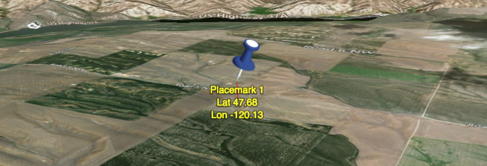

<style>
    iframe {
        width: 100 vw;
        height: 700px;
    }
</style>
# WebWorldWind Placemarks



Placemarks are customizable point markers that maintain their orientation to the screen. Their size is optionally dependent on range to the camera; however, the default configuration keeps them the same size with respect to the screen. Placemarks are highly customizable and support mouse or touch selecting and highlighting. Placemarks are renderables and require a `RenderableLayer` in order to be added the WorldWindow.

## Basic Placemark

1. Start by creating and adding a `RenderableLayer` that will host the Placemarks generated for this lesson. Be sure to add the layer to the WorldWindow.
    
    ```javascript
    var resortLocations = new WorldWind.RenderableLayer("Ski Resort Locations");
    wwd.addLayer(resortLocations);
    ```
    
2. Specify a position for the placemark:

    ```javascript
    var breckenridgePosition = new WorldWind.Position(39.481019, -106.045398, 0);
    ```
    
3. Create a placemark with a label and add it to the layer:

    ```javascript
    var breckenridge = new WorldWind.Placemark(breckenridgePosition);
    breckenridge.label = "Breckenridge";
    resortLocations.addRenderable(breckenridge);
    ```
    
    <script async src="//jsfiddle.net/nasazach/5uz10mxc/2/embed/"></script>
    
4. The default appearance of the placemark is a small white dot which happens to disappear as you move the camera closer. This due to terrain obscuring the dot because we did not modify the altitude mode of the placemark to `CLAMP_TO_GROUND`. Specifying the altitude mode is done by:

    ```javascript
    breckenridge.altitudeMode = WorldWind.CLAMP_TO_GROUND;
    ```
  
    Now you'll notice the white dot stays on top of the terrain and is not obsured as you move the camera closer.
    
5. The default white dot is pretty boring, while we could change the color and size, why not utilize the appropriate logo? To utilize a logo we need to point to the images URL using a `PlacemarkAttributes` object. Then we need to provide the attributes to the placemark.

    ```javascript
    var breckenridgeAttributes = new WorldWind.PlacemarkAttributes();
    breckenridgeAttributes.imageSource = "https://zglueck.github.io/workshop-demo/resources/images/breckenridge-logo.png";
    breckenridge.attributes = breckenridgeAttributes;
    ```
    
    <script async src="//jsfiddle.net/nasazach/5uz10mxc/4/embed/"></script>
    
6. The logo is better than the white dot, but it is enormous and becomes obscured by terrain at different viewing orientations. Let's enable autoscaling which will scale the image at extreme ranges. The scaling is limited, at a certain range threshold the logo will maintain its size independent of the range. Additionally, let's offset the logo so that it appears "above" our provided position.

    ```javascript
    breckenridge.eyeDistanceScaling = true;
    breckenridgeAttributes.imageOffset = new WorldWind.Offset(
       WorldWind.OFFSET_FRACTION, 0.5,
       WorldWind.OFFSET_FRACTION, 0);
    ```
    
    <script async src="//jsfiddle.net/nasazach/5uz10mxc/5/embed/"></script>
    
We've just completed creating a basic Placemark with a label and logo. Placemark includes additional functionality including:
- Leader Lines
- Highlight Attributes
- Canvas element image sources
- Label Attributes
- Label offsets

Please see the [Placemarks and Picking](https://files.worldwind.arc.nasa.gov/artifactory/apps/web/examples/PlacemarksAndPicking.html) and [Custom Placemarks](https://files.worldwind.arc.nasa.gov/artifactory/apps/web/examples/CustomPlacemarks.html) examples for demonstrations of these additional features.

[Index](../../)